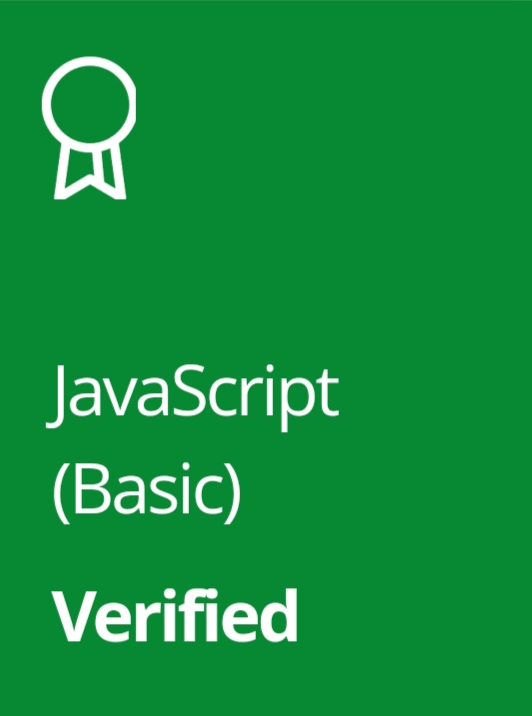

<p align="center">
    <a href="https://www.hackerrank.com/remembernothing1">
    
    </a>
</p>

```
@SomnathDas
```

# My HackerRank Solutions & Certifications

This repository contains my solutions for HackerRank problems and also certifications.


## My HackerRank Profile
<div align="center">
 </img>
<p><a href="https://giphy.com/gifs/cat-meow-neko-td3fwl4I8261W"></a></p>
</div>

<p align="center" > <a href="https://www.hackerrank.com/remembernothing1" > My Profile </a> </p>

## HackerRank Certificates

<a href="Certificates/javascript-basic-certification.png">
    
</a>


## Table Of Contents

* [Certificates](#certificates)
* [Mathmatics](#mathematics)
* [Algorithms](#algorithms)
* [1-Week-Preparation](#1-week-preparation)
* [Miscellaneous](#miscellaneous)

## Algorithms
| Name                    | Problem Url | Difficulty | Score | Solution |
|-------------------------|-------------|------------|-------|----------|
| Birthday Cake Candles         |       [ProblemUrl](https://www.hackerrank.com/challenges/birthday-cake-candles)      | Easy       | 10     |   [Solution](https://github.com/SomnathDas/HackerRank/blob/main/Algorithms/birthdayCakeCandles.js)       |
| Compare The Triplets               |     [ProblemUrl](https://www.hackerrank.com/challenges/compare-the-triplets)        | Easy       | 10    |   [Solution](https://github.com/SomnathDas/HackerRank/blob/main/Algorithms/compareTheTriplets.js)       |
| Staircase           |       [ProblemUrl](https://www.hackerrank.com/challenges/staircase/)      | Easy       | 10    |     [Solution](https://github.com/SomnathDas/HackerRank/blob/main/Algorithms/staircase.js)     |
| Grading Students |    [ProblemUrl](https://www.hackerrank.com/challenges/grading/problem)         | Easy       | 10    |    [Solution](https://github.com/SomnathDas/HackerRank/blob/main/Algorithms/gradingStudents.js)      |
| Simple Array Sum |    [ProblemUrl](https://www.hackerrank.com/challenges/simple-array-sum/problem)         | Easy       | 10    |    [Solution](https://github.com/SomnathDas/HackerRank/blob/main/Algorithms/simpleArraySum.js)      |
| Apple and Orange |    [ProblemUrl](https://www.hackerrank.com/challenges/apple-and-orange/problem)         | Easy       | 10    |    [Solution](https://github.com/SomnathDas/HackerRank/blob/main/Algorithms/appleAndOrange.ts)      |
| Number Line Jumps |    [ProblemUrl](https://www.hackerrank.com/challenges/kangaroo/problem)         | Easy       | 10    |    [Solution](https://github.com/SomnathDas/HackerRank/blob/main/Algorithms/numberLineJumps.ts)      |
| Breaking The Records |    [ProblemUrl](https://www.hackerrank.com/challenges/breaking-best-and-worst-records)         | Easy       | 10    |    [Solution](https://github.com/SomnathDas/HackerRank/blob/main/Algorithms/breakingTheRecords.ts)      |


## Mathematics
| Name                    | Problem Url | Difficulty | Score | Solution |
|-------------------------|-------------|------------|-------|----------|
| Find the Point          |       [ProblemUrl](https://www.hackerrank.com/challenges/find-point/problem)      | Easy       | 5     |   [Solution](https://github.com/SomnathDas/HackerRank/blob/main/Mathematics/findThePoint.js)       |
| Handshake               |     [ProblemUrl](https://www.hackerrank.com/challenges/handshake/problem)        | Easy       | 10    |   [Solution](https://github.com/SomnathDas/HackerRank/blob/main/Mathematics/handShake.js)       |
| Maximum Draws           |       [ProblemUrl](https://www.hackerrank.com/challenges/maximum-draws/problem)      | Easy       | 5     |     [Solution](https://github.com/SomnathDas/HackerRank/blob/main/Mathematics/maximumDraws.js)     |
| Minimum Height Triangle |    [ProblemUrl](https://www.hackerrank.com/challenges/lowest-triangle/problem)         | Easy       | 10    |    [Solution](https://github.com/SomnathDas/HackerRank/blob/main/Mathematics/minimumHeightTriangle.js)      |

## 1-Week-Preparation
### Day-1
| Name                    | Problem Url | Difficulty | Score | Solution |
|-------------------------|-------------|------------|-------|----------|
| Plus Minus          |       [ProblemUrl](https://www.hackerrank.com/challenges/one-week-preparation-kit-plus-minus/problem?h_l=interview&playlist_slugs%5B%5D=preparation-kits&playlist_slugs%5B%5D=one-week-preparation-kit&playlist_slugs%5B%5D=one-week-day-one)      | Easy       | 100     |   [Solution](https://github.com/SomnathDas/HackerRank/blob/main/One-Week-Preparation/Day1/plusMinus.js)       |
| Mini Max Sum              |     [ProblemUrl](https://www.hackerrank.com/challenges/one-week-preparation-kit-plus-minus/problem?h_l=interview&playlist_slugs%5B%5D=preparation-kits&playlist_slugs%5B%5D=one-week-preparation-kit&playlist_slugs%5B%5D=one-week-day-one)        | Easy       | 100    |   [Solution](https://github.com/SomnathDas/HackerRank/blob/main/One-Week-Preparation/Day1/miniMaxSum.js)       |
| Time Conversion           |       [ProblemUrl](https://www.hackerrank.com/challenges/one-week-preparation-kit-time-conversion/problem?h_l=interview&playlist_slugs%5B%5D=preparation-kits&playlist_slugs%5B%5D=one-week-preparation-kit&playlist_slugs%5B%5D=one-week-day-one)      | Easy       | 100     |     [Solution](https://github.com/SomnathDas/HackerRank/blob/main/One-Week-Preparation/Day1/timeConversion.js)     |

## Miscellaneous
| Name                    | Problem Url | Difficulty | Score | Solution |
|-------------------------|-------------|------------|-------|----------|
| Dictionaries and Map          |       [ProblemUrl](https://www.hackerrank.com/challenges/30-dictionaries-and-maps/problem)      | Easy       | 30     |   [Solution](https://github.com/SomnathDas/HackerRank/blob/main/Misc/mapDataStructure.js)       |


## Certificates
| Skill      | Difficulty | Certificates |
|------------|------------|--------------|
| Javascript | Basic      |       [My Certificate](https://www.hackerrank.com/certificates/aaa22f5f7ed2)       |

